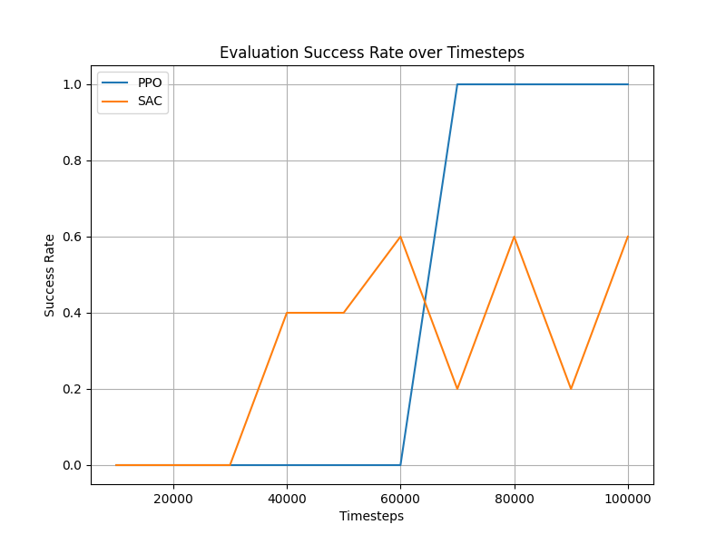
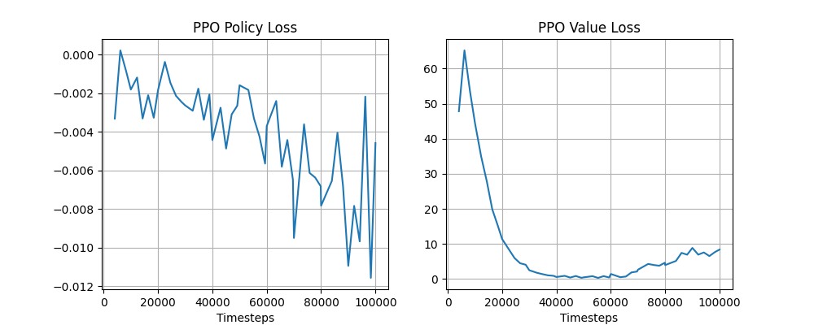
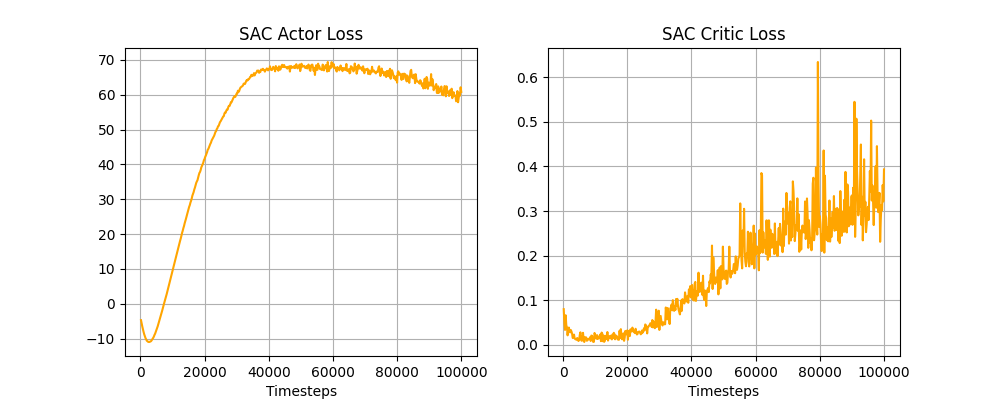
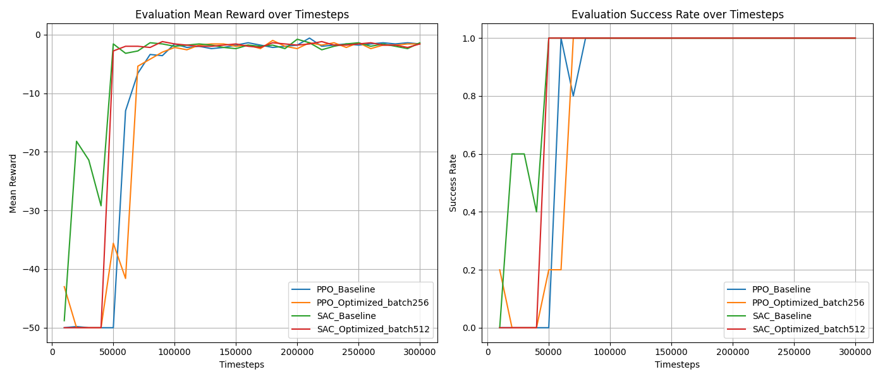
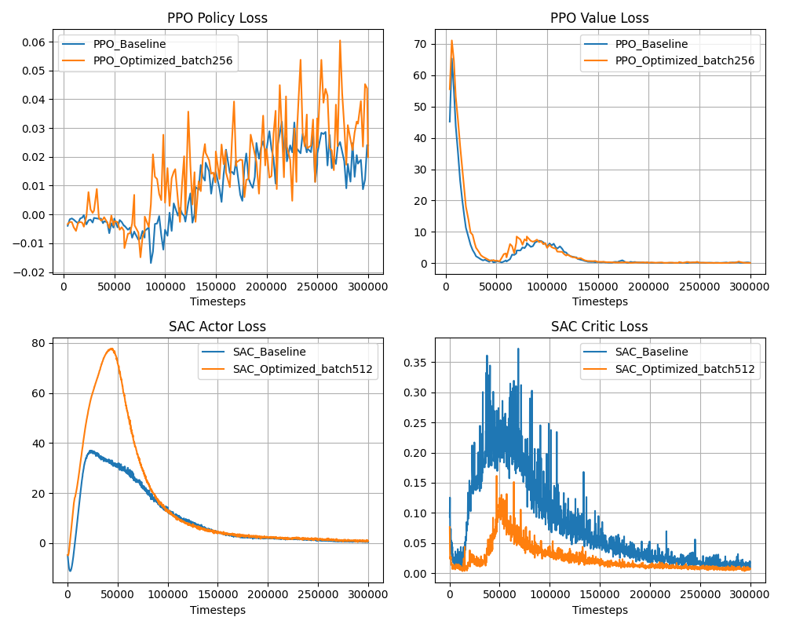
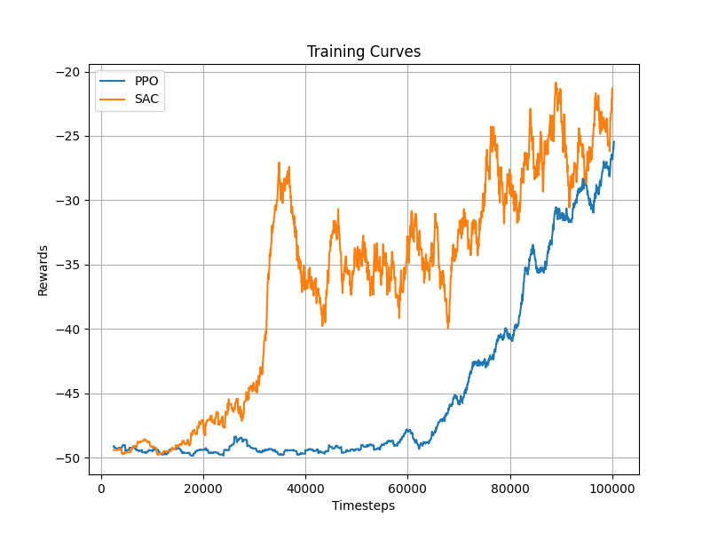
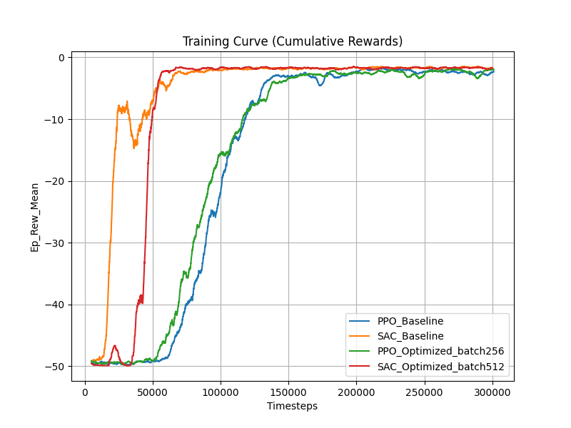
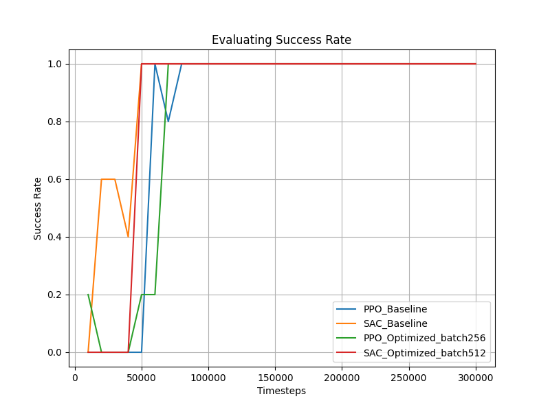

# Experimental Report on Continuous Control for Robotic Arm using Reinforcement Learning
**—— Performance Comparison and Hyperparameter Ablation Study of PPO and SAC Algorithms**

## 1. Experimental Background and Task Introduction

### 1.1 Codebase and Experiment Summary
The experimental codebase is built on deep reinforcement learning frameworks. The complete project directory and experimental branch structure are as follows:

```text
ROBO_MANU/
├── main.py                     # Main script for basic PPO/SAC algorithm operation and evaluation
├── train_advanced.py           # Dedicated training script for advanced hyperparameter tuning and ablation studies
├── plot_metrics.py / scripts   # Supporting scripts for experimental metric processing and chart generation
├── logs/                       # Under 100k-step baseline configuration: Model checkpoints and npz evaluation files
├── logs_advanced/              # Under advanced ablation parameter groups: Performance leap checkpoints and evaluation logs
├── tb_logs/ & tb_logs_advanced/# (Subdirectories) TensorBoard monitoring event saved stacks for each stage
├── videos/                     # (Subdirectory) Visualized recordings of the agent controlling the gripper during evaluation
└── Report.md                   # Core evaluation report and illustrated summary for this experiment
```

The overall framework includes training modules for both baseline models and advanced tuned models (advanced ablation groups) (e.g., `train_advanced.py`, `main.py`). Tracking evaluation results are extracted via TensorBoard (in directories like `tb_logs`) and monitoring scripts. The experiment primarily compares and optimizes two mainstream algorithms in the continuous control domain: **PPO** (Proximal Policy Optimization) and **SAC** (Soft Actor-Critic).
* **Theoretical Advantages of PPO:** As an On-policy strategy gradient algorithm, PPO strictly controls the step size of policy updates by clipping the surrogate objective function (Clipped Surrogate Objective), effectively preventing destructive large-scale parameter updates. Thus, PPO features robust convergence characteristics, ease of deployment, and good default robustness for most physical control tasks.
* **Theoretical Advantages of SAC:** As an Off-policy algorithm based on maximum entropy reinforcement learning, the theoretical core of SAC lies in maximizing the cumulative reward while simultaneously maximizing the strategy's action entropy. This mechanism naturally encourages the agent to conduct broader spatial exploration, preventing premature convergence to local optima. Coupled with the Replay Buffer, it tremendously enhances sample utilization efficiency in continuous action spaces.

### 1.2 FetchReach Task Setup and Environment Configuration
The evaluation environment selected for this experiment is the `FetchReach-v4` environment from the OpenAI Gym robotics series. This environment is a typical constrained continuous physics simulation scenario, requiring precise movement of the Fetch robotic arm's end gripper to touch and stay within a randomly generated red target point in space.
* **State Space:** The environmental state feedback is based on a multi-layer dictionary (Dict). Its primary observations (Observation) include the 3D Cartesian relative coordinates ($x, y, z$) of the robotic arm's end gripper, the velocity and position variables of major control joints, and the positional mapping information of the target point relative to itself (a total of 10-dimensional continuous floating-point numbers).
* **Action Space:** Being a typical continuous control task, it accepts a 4-dimensional continuous action vector `Box(-1.0, 1.0, (4,))`. The first three dimensions represent the target linear displacements of the robotic arm's end along the $x, y, z$ orthogonal axes; the fourth dimension is the gripper opening/closing coefficient (however, since there are no grasping behavior requirements in pure reach tasks, it defaults to an invalid or locked state).
* **Reward Function:** This environment defaults to a classic Sparse Reward design. When the gripper fails to enter the spherical tolerance zone centered on the target point, it receives a fixed time-step penalty of $-1$ for every invalid movement. When reaching the time limit or engaging the target point, the reward converges to $0$. Hence, the overall accumulated returns for model training are negative. A smaller absolute value closer to 0 indicates shorter trajectory times planned by the model and higher pathfinding efficiency.

## 2. Experimental Results Overview Table


| Experimental Group / Model Config | Final Mean Reward (Last 5 trials) | Max Mean Reward | Final Success Rate (Last 5 trials) | Max Success Rate |
| :--- | :--- | :--- | :--- | :--- |
| **Baseline Parameter Group (100k timesteps)** | | | | |
| PPO (`PPO_FetchReach-v4`) | -14.40 | **-2.40** | 80.00% | **100.00%** |
| SAC (`SAC_FetchReach-v4`) | -28.80 | -20.80 | 44.00% | 60.00% |
| **Advanced Parameters/Ablation Group (Advanced)**| | | | |
| PPO Baseline | **-1.52** | **-0.60** | **100.00%** | **100.00%** |
| PPO Optimized (Batch 256) | -1.84 | -1.00 | **100.00%** | **100.00%** |
| SAC Baseline | -1.88 | -0.80 | **100.00%** | **100.00%** |
| SAC Optimized (Batch 512) | -1.76 | -1.20 | **100.00%** | **100.00%** |

*(Note: Returns in this environment are generally negative; larger values closer to 0 denote higher efficiency in reaching targets; Success rate represents the likelihood of the end-effector reaching the target point.)*

## 3. Baseline Algorithm Comparison Study (100k Steps Scale)
In the baseline group experiment without specific environmental hyperparameter tuning (100k timesteps), the two algorithms demonstrated significant differences.



* **PPO Performance:** Exhibited relatively good sample robustness, achieving a final success rate of 80% (with peak touches reaching 100%), and the final mean reward converged to around -14.40.
* **SAC Performance:** The baseline parameters evidently did not coordinate suitably with this environment; the final success rate hovered only around 44%, resulting in highly diminished mean rewards (-28.80 approx.).

**Loss Function Analysis:**
- **PPO Loss:**


- **SAC Loss:**


The outcomes indicate that under default parameters, PPO's robustness in this continuous control context is superior to that of SAC. Conversely, SAC might have fallen into suboptimal solutions or suffered profound oscillations initially, likely driven by default temperature coefficients (Temperature) and exploration noises mismatching the current state space scales.

## 4. Hyperparameter Optimization-Based Ablation Study
To unearth the actual potential of the algorithms in this environment, refined prior parameters specifically tuned for robotic tasks (Advanced group) were introduced, and an ablation experiment mainly centering on Batch Size was conducted.

### 4.1 Environment Interaction Performance Comparison (Success Rate and Reward)

*As shown in the graph (mean reward on the left, success rate on the right):*
1. **Overall Leap:** Vastly contrasting the baseline experiment, PPO and SAC both shattered performance bottlenecks following the incorporation of advanced tuning parameters, **hitting a steady 100% success rate across the board**, with ultimate Rewards closing to approximately -1.5 (an optimal convergence state since target penalties have been minimized). This evidences that hyperparameter selection plays a decisive role in continuous control RL tasks.
2. **Batch Size Ablation Conclusion:**
   * **PPO Derivative Groups:** The final converged return for baseline parameters (-1.52) modestly outperformed the Batch Size=256 group (-1.84), suggesting that default batch allocations practically yield optimal gradient update orientations in this arrangement.
   * **SAC Derivative Groups:** As exploration parameters were appropriately tuned, SAC manifested outstanding data efficiency, overcoming previous issues of baseline unconvergence. Regardless of whether under Baseline or Batch Size=512 sets, both achieved swift access in minimal timesteps and stabilized at robust 100% success rates.

### 4.2 Loss Convergence Status Monitoring

* **Network Assessment Status:** Pertaining to the value network for PPO and SAC (Value/Critic Loss), a logical descending trend can be witnessed accompanied by persistence traversing quite low convergence threshold ranges as instruction steps amplify, showing that the agents' reward expectation estimation for current environmental states is exceedingly accurate.
* **Strategy Optimization:** The alterations shown in the strategic network (Policy/Actor Loss) expose an excellent equilibrium of exploration and exploitation, solidifying reliable reaching tracks inside finite amounts of steps.

## 5. Behavioral Visualization (Qualitative Results)
Verified video playbacks mapped via visual rendering of totally trained models have been outputted. Inside playback records `videos/PPO/PPO_FetchReach.gif` and `videos/SAC/SAC_FetchReach.gif`, it is qualitatively visible that the previously untrained and erratically wavering robotic arms can now develop remarkably smooth displacement paths without superficial tremoring, precisely pausing upon targeted red sphere locations in brief frames. This qualitatively confirms perfectly the 100% success rate benchmarks.

## 6. Conclusion
1. **Algorithm Characteristics and Tuning Demands:** While PPO outlines superior default resilience underneath this environment wrapper, SAC as an Off-policy algorithm is radically dependent on hyperparameter adjustment arrays (specifically configuring exploration mechanisms).
2. **Parameters are Supreme:** Through continuous control tasks, **hyperparameter tuning dictates primarily as the core precondition to a model's puzzle resolution attributes**. Both parameter-tuned SAC and PPO manifest majestic ceiling potential natively, successfully solving FetchReach protocols in highly effective dimensions.

## 7. Appendix: Early Monitoring Curves and Evaluation Testing
Aside from the baseline 100k timestep reviews and high-level ablation groups previously stated, independent specific assessment photos pulled from preliminary stages operate as additional report elements natively.

### Training Reward Curve
Exhibiting spontaneous training rewards at the fundamental model initial stages natively:


### Specific Evaluation Testing Data (Independent Evaluation)
Verifying achievement reward displays and success rate elements natively utilizing stand-alone testing mechanisms:
* **Evaluation Set Reward Curve:**


* **Evaluation Set Success Rate Curve:**

